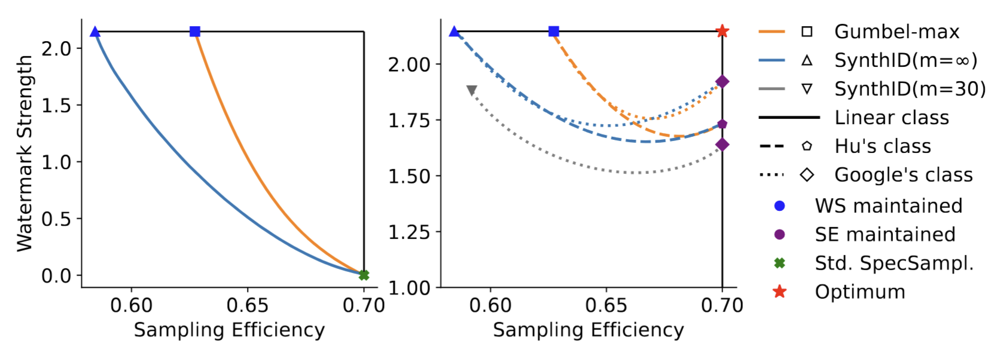

## Break the Trade-off Between Watermark Strength and Speculative Sampling Efficiency for Language Models

This repository contains the official implementation for the ICLR 2026 paper **“Break the Trade-off Between Watermark Strength and Speculative Sampling Efficiency for Language Models.”**

**Codebase origin (2 prior works):**
- [work 1](https://arxiv.org/abs/2410.20418): *“Inevitable Trade-off between Watermark Strength and Speculative Sampling Efficiency for Language Models”* — provides the overall experimental framework.
- [work 2](https://www.nature.com/articles/s41586-024-08025-4): *“Scalable watermarking for identifying large language model outputs”* — provides the SynthID watermarking algorithms.

---

Watermarking enables provenance tracing for LLM outputs but often conflicts with efficient inference. While speculative sampling speeds up generation, stronger watermarks typically reduce draft–target acceptance, creating an apparent trade-off between efficiency and detectability.
We show that this trade-off can be improved. By formalizing watermark strength and its connection to pseudorandomness, we characterize the efficiency–detectability frontier and propose a principled mechanism that preserves speculative sampling efficiency while achieving strong, detectable watermarks. Experiments confirm improved detectability **without** sacrificing efficiency.

---

## 🧭 Repository Structure

### `real/`
Contains the main experimental implementations:
- **`unbiased_watermark/`**: Core watermarking algorithms including SynthID and Gumbel-based methods.
- **`my_experiment/`**: Experiment configurations and execution scripts for different model combinations.
  - `main.py`: Runs the Gumbel-max experiments with and without speculative sampling.
  - `synthid_experiment_mc.py`: Runs SynthID experiments **with** speculative sampling.
  - `synthid_experiment_basic.py`: Runs SynthID experiments **without** speculative sampling.
  - `gumbel_detect.py`: Detection pipeline for the Gumbel-max experiments.
  - `bayesian_detector.py`: Detection pipeline for the SynthID experiments.
  - `human_data.py`: Script for collecting human data for the SynthID detector.
  - `configs/`: Jsonnet configuration files for the basic and Gumbel-max experiments.
- **`experiments/`**: Borrowed from [work 1](https://arxiv.org/abs/2410.20418); includes utilities such as `tasks.py`.
- **`accuwm/`**: Various LM inference algorithms.
  - `mc_synthid.py`: Algorithm 1 for SynthID watermarking.
  - `mc_watermark.py`: Algorithm 1 for Gumbel-max watermarking.

### `simulation/`
Contains simulation code for theoretical analysis (Section 3.2):
- **`utils.py`**: Mathematical utility functions for sampling and probability computations.
- **`simulation_trade-off_linear.py`**: Generates trade-off curves for linear watermarked classes.
- **`simulation_trade-off_Hu-Google.py`**: Generates trade-off curves for Hu’s and Google’s watermarking classes.

### `slurm_scripts/`
Contains SLURM scripts for running experiments. You can modify the script arguments to run different configurations and models.

## 🛠️ Requirements

- Python 3.9+
- PyTorch >= 2.0.0
- Transformers >= 4.30.0
- NumPy >= 1.24.0
- Additional dependencies listed in `real/my_experiment/requirements.txt`
